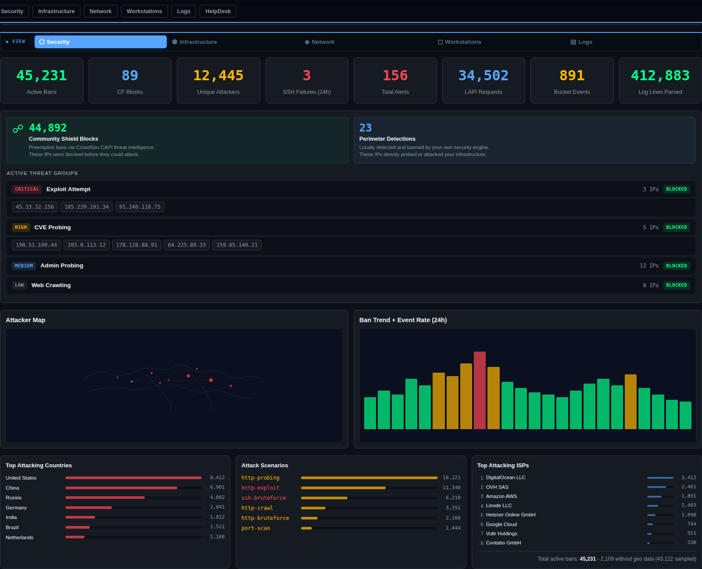
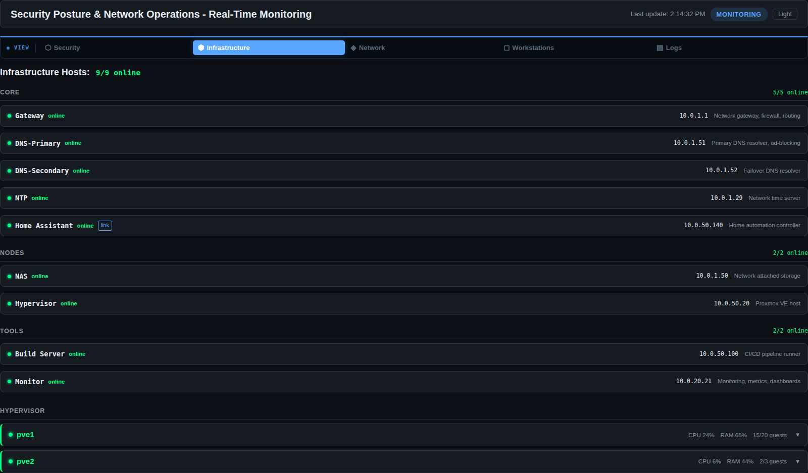
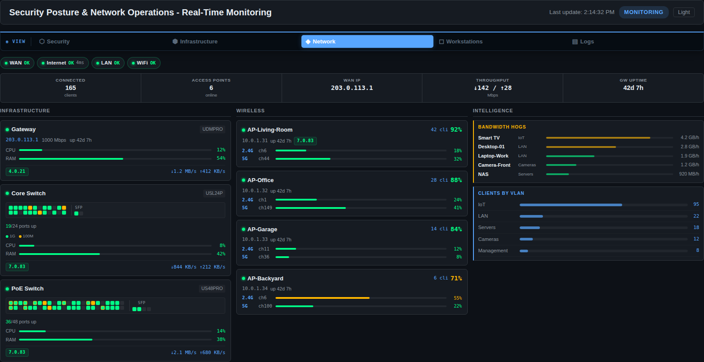
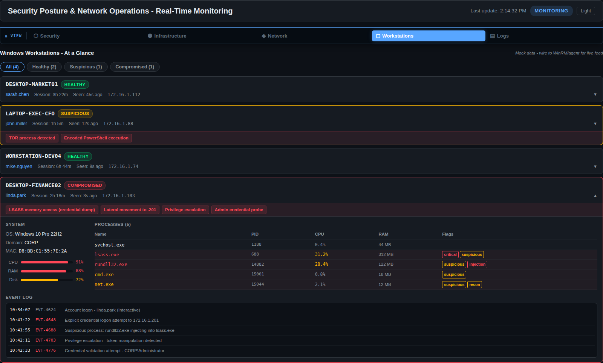
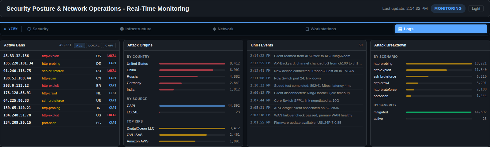
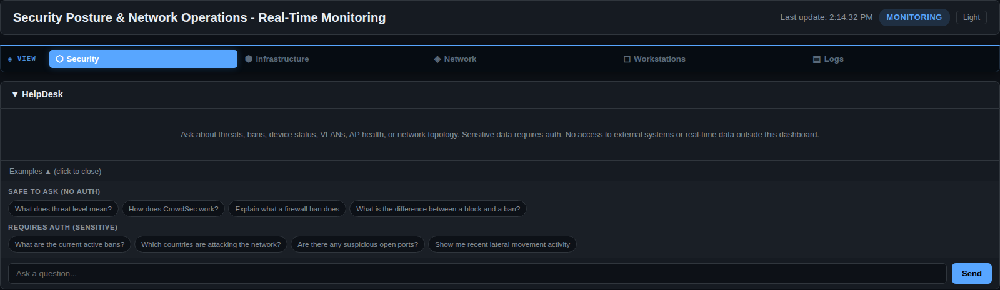

<p align="right">
  
  
  
  
</p>

<p align="left">
  
</p>

> Not 100% production ready, but close.  While it is mostly read only, you should always review the code and be mindful of upstream dependencies.

Real-time security and network operations dashboard for homelabs. One screen to monitor everything: firewall bans, network devices, hypervisor health, endpoint status, and event logs.

SecNet pulls live data from sources you add (CrowdSec, UniFi, Proxmox, Loki, and Prometheus, etc) then presents it in a single tabbed interface. An OpenAI-powered HelpDesk lets you ask relevant questions about your infrastructure without leaving the dashboard.

Every integration is optional. Only have CrowdSec and UniFi? The dashboard shows those tabs and hides the rest. No errors, no empty screens. Add more services later by dropping their credentials into `.env`.

Built with FastAPI and React, packaged as a single Docker container.

## Screenshots

> All screenshots below show demo data, not a real network.

### Security Overview

Live threat level, active ban count, attacker geo-map, 24-hour ban trends, and a full attack breakdown grouped by severity (Critical, High, Medium, Low). Each group expands to show the individual attacker IPs.



### Infrastructure

Host registry organized by group (Core, Nodes, Tools, Workstations). Each host shows online/offline status with live port checks. Proxmox hypervisors display CPU, RAM, and guest counts. Sensitive operations like port scanning require gate credentials.



### Network Health

Three-column layout. Left: gateway and switches with realistic port faceplate graphics (color-coded by link speed, amber borders for PoE). Center: access points with per-radio channel utilization bars and client counts. Right: intelligence panel with bandwidth hogs, weak WiFi clients, firmware alerts, and client distribution by VLAN.



### Workstations

Cross-platform endpoint monitoring via lightweight agents (Windows, Linux, macOS). Filter by health status (Healthy, Suspicious, Compromised). Expand any workstation to see running processes with flags (credential dump, injection, recon), system utilization, and a security event log with timestamps and event IDs.



### Logs

Four live feeds side by side: CrowdSec active bans (filterable by LOCAL/CAPI), attack origins broken down by country and ISP, UniFi network events, and attack scenario breakdown by type and severity.



### HelpDesk (API driven)

A low cost and relatively basic OpenAI-powered assistant [will add additional options if requested] that knows your dashboard context. It will (should) answer general security questions related to security without authentication. Questions about your specific infrastructure (IPs, bans, topology) require gate credentials first. Includes example prompts for both categories.



## Features

- **Fullscreen mode** for wall-mounted displays, tablets, or dedicated monitoring screens. Works on desktop and mobile browsers via the Fullscreen API.
- **Dark and light themes** with a one-click toggle
- **Stale-data-first loading** using localStorage caching. The dashboard shows cached data instantly on load, then updates in the background with a subtle indicator. No "Loading..." screens after your first visit.
- **WebSocket live feed** pushes summary updates every 15 seconds without polling
- **Auth gate** with server-side validation, rate limiting (5 attempts/minute), and constant-time comparison
- **Feature flags** to enable/disable any integration via environment variables
- **Workstation agents** for Windows, Linux, and macOS that report as native OS services

### Coming Soon

- **Windows installer (EXE)** for standalone desktop use
- **Android app (APK)** for mobile monitoring

## Quick Start

### Using Docker Compose (recommended)

```bash
git clone https://github.com/danktankk/SecNet.git
cd SecNet

# Set up your configuration
cp .env.example .env
# Edit .env with your service URLs and API keys

# Start the dashboard
docker compose up -d
```

### Building from source

If you prefer to build the image yourself:

```bash
docker compose up -d --build
```

### Seeding the host database (optional)

The Infrastructure tab reads hosts from a SQLite database. To populate it with your own infrastructure:

```bash
cp scripts/init-db.example.py scripts/init-db.py
# Edit scripts/init-db.py with your hosts, IPs, and roles

docker run --rm -v $(pwd)/data:/data -v $(pwd)/scripts:/scripts python:3.12-slim \
  python /scripts/init-db.py
```

Open `http://localhost:8088` (or your host IP on port 8088).

## Workstation Agents

Lightweight agents report system stats, running processes, and security events to the Workstations tab every 30 seconds. Each agent runs as a native OS service — starts on boot, restarts on failure, no terminal window required.

Before installing: set `WORKSTATION_AGENT_KEY` in your SecNet `.env` on the server. That key goes into the install command below. `ENABLE_WORKSTATIONS=true` is the default.

---

### Windows

Download the latest `secnet-agent.exe` from the [Releases](https://github.com/danktankk/SecNet/releases/latest) page.

1. **Right-click → Run as administrator**
2. Enter your SecNet URL and agent key, click **Save Config & Test Connection**
3. Click **Install**, then **Start**

The GUI manages the Windows service. Come back to it any time to stop, restart, or remove the agent.

**What it collects:** CPU, RAM, disk, top 40 processes (normalized CPU%), Windows Security Event Log (logon events, failures, privilege escalation, service installs), AD domain.

**Config:** `C:\ProgramData\SecNet\agent.json`
**Log:** `C:\ProgramData\SecNet\agent.log` (rotates at 5 MB, keeps 3 backups)
**Service name:** `SecNetAgent` (visible in `services.msc`)

**Updating:** Download the new EXE, run as administrator, click Stop → Remove → Install → Start. Your config is preserved.

---

### Linux

One command installs everything: Python venv, psutil/requests, the agent, systemd unit, and starts the service.

```bash
curl -fsSL https://raw.githubusercontent.com/danktankk/SecNet/main/agents/install-linux.sh \
  | sudo bash -s -- --url http://YOUR_SECNET:8088 --key YOUR_AGENT_KEY
```

**What it collects:** CPU, RAM, disk, top 40 processes (normalized CPU%), SSH auth events from journalctl (falls back to `/var/log/auth.log`), distro info.

**After install:**
```bash
sudo systemctl status secnet-agent    # is it running?
journalctl -u secnet-agent -f         # live logs
sudo systemctl restart secnet-agent   # restart
sudo systemctl disable secnet-agent   # remove from autostart
```

**Updating an existing install:**
```bash
sudo curl -fsSL https://raw.githubusercontent.com/danktankk/SecNet/main/agents/secnet-agent-linux.py \
  -o /usr/local/bin/secnet-agent && sudo systemctl restart secnet-agent
```

**Config:** `/etc/secnet/agent.json` (0600)
**Service:** `/etc/systemd/system/secnet-agent.service`
**Logs:** `journalctl -u secnet-agent -f`

---

### macOS

One command installs everything: Python venv, psutil/requests, the agent, launchd plist, and loads the service.

```bash
curl -fsSL https://raw.githubusercontent.com/danktankk/SecNet/main/agents/install-mac.sh \
  | sudo bash -s -- --url http://YOUR_SECNET:8088 --key YOUR_AGENT_KEY
```

**What it collects:** CPU, RAM, disk, top 40 processes (normalized CPU%), Unified Log security events (securityd, sshd, authentication), macOS version.

**After install:**
```bash
tail -f /Library/Logs/secnet-agent.log                                          # live logs
sudo launchctl bootout system /Library/LaunchDaemons/com.secnet.agent.plist     # stop
sudo launchctl bootstrap system /Library/LaunchDaemons/com.secnet.agent.plist   # start
launchctl list com.secnet.agent                                                  # status
```

**Updating or reinstalling:** Re-run the same install command. The script tears down the existing service, rebuilds the venv, and reloads cleanly.

**Config:** `/etc/secnet/agent.json` (0600)
**Plist:** `/Library/LaunchDaemons/com.secnet.agent.plist`
**Log:** `/Library/Logs/secnet-agent.log`

**macOS troubleshooting:**

| Symptom | Fix |
|---------|-----|
| `Bad file descriptor` | Don't use `sudo bash <(...)`. Use the pipe form: `curl ... | sudo bash -s -- --url ...` |
| `python3 not found` | Install Python: `brew install python3`, then rerun the install command |
| `launchctl bootstrap failed` | Run `sudo launchctl bootout system /Library/LaunchDaemons/com.secnet.agent.plist` then rerun install |
| Service loaded but not reporting | Check `tail -f /Library/Logs/secnet-agent.log` for connection errors; verify URL and key |
| `/usr/local/bin: No such file` | The install script creates this directory automatically — rerun and it will succeed |

> **Note:** Requires macOS 11 (Big Sur) or later. Uses `launchctl bootstrap` — the correct method for system daemons on modern macOS.

---

### How the agents work

All three share the same design:

- **Config file** stores the dashboard URL and agent key. Written once at install, read on every start.
- **Native service** (Windows Service / systemd / launchd) starts automatically on boot and restarts on failure.
- **30-second loop** collects stats and POSTs to `/api/workstations/report`. CPU is measured over the full 30-second window — not a blocking 1-second sample — so the agent uses negligible CPU itself.
- **Graceful shutdown** on SIGTERM or service stop, no zombie processes.

```
  Workstation                         SecNet Server
  +----------+   POST every 30s       +------------+
  |  Agent   | ---------------------->| :8088      |
  | (service)|  /api/workstations/    | Workstations|
  +----------+  report                | tab        |
                                      +------------+
```

## Configuration

All configuration lives in `.env`. See `.env.example` for the full list with comments.

### Integrations

Every integration is optional. Configure only what you have.

| Integration | Required Variables | What You Get |
|------------|-------------------|--------------|
| CrowdSec | `CROWDSEC_URL`, `CROWDSEC_API_KEY` | Ban tracking, attacker geo-mapping, threat intel, attack breakdown |
| UniFi | `UNIFI_URL`, `UNIFI_USERNAME`, `UNIFI_PASSWORD` | AP health, switch port status, client monitoring, VLAN distribution |
| Proxmox | `PVE1_URL`, `PVE1_TOKEN` (supports up to 3 nodes) | Hypervisor CPU/RAM, VM and container inventory. VMs need qemu-guest-agent; LXCs need static IPs in net config for auto-discovery. |
| Loki | `LOKI_URL` | Log aggregation, Traefik and CrowdSec event feeds |
| Prometheus | `PROMETHEUS_URL` | Metrics and alerting data |
| OpenAI | `OPENAI_API_KEY` | AI security assistant (HelpDesk tab) |
| Workstations | `WORKSTATION_AGENT_KEY` | Endpoint monitoring via platform agents |

### Feature Flags

Explicitly disable any integration by setting its flag to `false`:

```bash
ENABLE_CROWDSEC=false
ENABLE_UNIFI=false
ENABLE_PROXMOX=false
ENABLE_LOKI=false
ENABLE_PROMETHEUS=false
ENABLE_OPENAI=false
ENABLE_WORKSTATIONS=false
```

Disabled integrations return empty data from their API endpoints. The frontend hides tabs and sections that have no active data source. The Security tab is always visible since it aggregates from multiple sources and degrades gracefully.

### Auth Gate

Set `SECURITY_GATE_CODE` to protect sensitive operations (network scans, AI chat with infrastructure context). The gate uses server-side validation with rate limiting and constant-time string comparison.

## Architecture

```
SecNet/
  backend/
    config.py          # Pydantic settings, feature flags
    main.py            # FastAPI app, lifespan, static file serving
    db.py              # SQLite connection, schema init
    routers/
      api.py           # REST endpoints, auth gate, rate limiting
      ws.py            # WebSocket live feed
    services/
      aggregator.py    # Data aggregation, threat level calculation
      chat.py          # OpenAI chat with gate enforcement
      data_layer.py    # CrowdSec, Loki, Prometheus API clients
      hosts.py         # Host registry from SQLite
      network.py       # Proxmox inventory, nmap port scanning
      unifi.py         # UniFi clients, devices, health
      workstations.py  # In-memory workstation store
  frontend/
    src/
      App.jsx          # Tab layout, feature-aware routing
      hooks/useApi.js  # Polling with localStorage cache
      components/      # One component per tab
  agents/
    secnet-agent.py         # Windows agent (service + console)
    secnet-agent-linux.py   # Linux agent (systemd + console)
    secnet-agent-mac.py     # macOS agent (launchd + console)
  docker-compose.yml
  Dockerfile           # Multi-stage build: Node frontend + Python backend
```

The frontend is compiled at image build time and served as static files by FastAPI. A WebSocket connection pushes live summary updates. HTTP polling with localStorage caching means the dashboard loads instantly on return visits, showing cached data while fresh data arrives in the background.

## Security

- Auth gate is validated server-side only. The frontend sends a token header; the backend checks it.
- Gate-check endpoint is rate-limited: 5 attempts per 60 seconds per IP.
- Gate code comparison uses `hmac.compare_digest` to prevent timing attacks.
- nmap scan input is validated with `ipaddress.ip_address()` before execution.
- All secrets live in `.env` (gitignored). The repository ships with zero credentials.
- Agent config files are stored with restricted permissions (0600 on Linux/macOS).
- A pre-push secret scanner is included at `scripts/check-secrets.py`.

## License

AGPL-3.0. See [LICENSE](LICENSE) for details.
